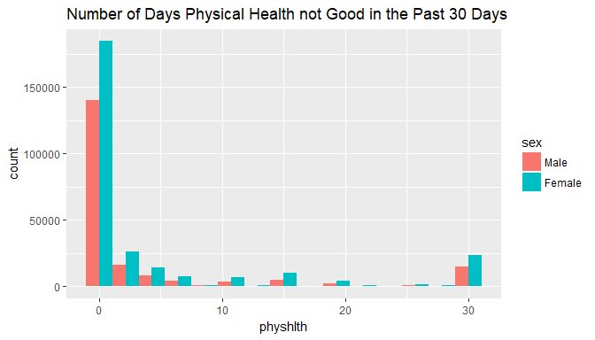
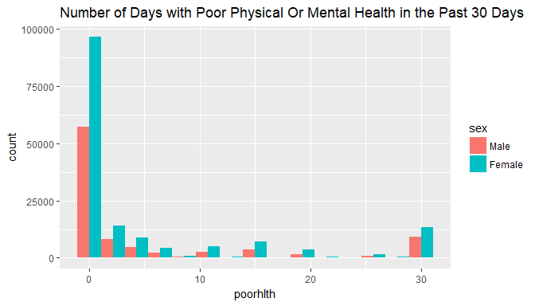
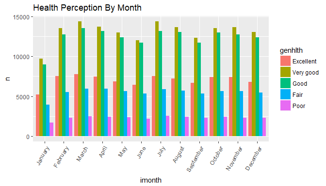
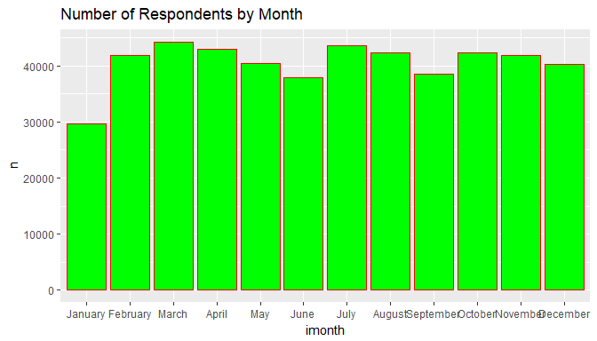
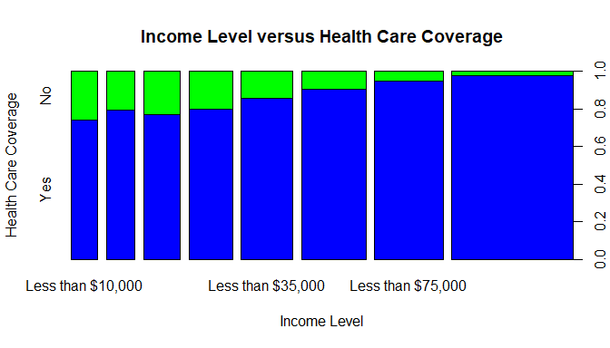

## Setup
The Behavioral Risk Factor Surveillance System (BRFSS) is an annual telephone survey in the United States. The BRFSS is designed to identify so-called risk factors in the adult population and report emerging trends. For example, respondents are asked about their diet and weekly physical activity, their HIV/AIDS status, possible tobacco use, immunization, health status, healthy days - health-related quality of life, health care access, inadequate sleep, hypertension awareness, cholesterol awareness, chronic health conditions, alcohol consumption, fruits and vegetables consumption, arthritis burden, and seatbelt use etc

### Load packages


```r
library(ggplot2)
library(dplyr)
```

### Loading data


```r
load("brfss2013.RData")
```


* * *

## Part 1: Data
Data collection procedure is explained in brfss_codebook. The data were collected from United States' all 50 states, the District of Columbia, Puerto Rico, Guam and American Samoa, Federated States of Micronesia, and Palau, by conducting both landline telephone- and cellular telephone-based surveys. Disproportionate stratified sampling (DSS) has been used for the landline sample and the cellular telephone respondents are randomly selected with each having equal probability of selection. The dataset we are working on contains 330 variables for a total of 491, 775 samples in 2013. The missing values denoted by "NA"


* * *

## Part 2: Research questions

**Research quesion 1:**
Does the distribution of the number of days in which physical and mental health was not good during the past 30 days differ by gender.


```r
summary(brfss2013$physhlth)
```

```
##    Min. 1st Qu.  Median    Mean 3rd Qu.    Max.    NA's 
##   0.000   0.000   0.000   4.353   3.000  60.000   10957
```


**Research quesion 2:**
Is there an association between the month in which a respondent was interviewed and the respondent’s self-reported health perception?

**Research quesion 3:**
Is there any association between income and health care coverage

* * *

## Part 3:A) Exploratory data analysis for "REsearch question 1"


```r
ggplot(aes(x=physhlth, fill=sex), data = brfss2013[!is.na(brfss2013$sex), ]) +
  geom_histogram(bins=15, position = position_dodge()) + ggtitle('Number of Days Physical Health not Good in the Past 30 Days')
```

```
## Warning: Removed 10953 rows containing non-finite values (stat_bin).
```

<!-- -->


```r
ggplot(aes(x=poorhlth, fill=sex), data=brfss2013[!is.na(brfss2013$sex), ]) +
  geom_histogram(bins=15, position = position_dodge()) + ggtitle('Number of Days with Poor Physical Or Mental Health in the Past 30 Days')
```

```
## Warning: Removed 243149 rows containing non-finite values (stat_bin).
```

<!-- -->

The above two figures show the data distribution of how male and female responder to the number of days physical, mental and both health not good during the past 30 days. We can see that there were more number of female respondents than male respondents.

**Research quesion 2:**


```r
by_month <- brfss2013 %>% filter(iyear=='2013') %>% group_by(imonth,genhlth) %>% summarise(n=n())
ggplot(aes(x=imonth, y=n, fill = genhlth), data = by_month[!is.na(by_month$genhlth), ]) + geom_bar(stat = 'identity', position = position_dodge()) + ggtitle('Health Perception By Month')+theme(axis.text.x = element_text(angle = 60, hjust = 1))
```

<!-- -->


```r
by_month1 <- brfss2013 %>% filter(iyear=='2013') %>% group_by(imonth) %>% summarise(n=n())
ggplot(aes(x=imonth, y=n), data=by_month1) + geom_bar(stat = 'identity',color="red",fill="green") + ggtitle('Number of Respondents by Month')
```

<!-- -->

I was trying to find out any exited pattern whether people respond their health condition differently in the different month. For example, are people more likely to say they are in good health in the spring or summer? It appears from graph that there was no obvious pattern.

**Research quesion 3:**


```r
plot(brfss2013$income2, brfss2013$hlthpln1,col=c("blue","green"), xlab = 'Income Level', ylab = 'Health Care Coverage', main =
'Income Level versus Health Care Coverage')
```

<!-- -->

Above graph clearly shows that higher income respondents are more likely to have health care coverage then those of lower income respondents


## Summary

When we analyze health survery data, we must be aware that self-reported prevalence may be biased because respondents may not be aware of their risk status There is no causation can be established as BRFSS is an observation study that can only establish correlation/association between variables.
